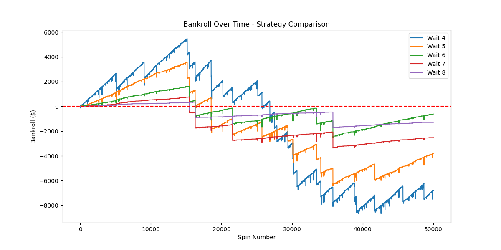

# Martingale Hunch - Comparative Analysis

## Overview
We tested the Martingale Hunch strategy with varying `wait_streak` values (4, 5, 6, 7, 8) over **50,000 spins** to see if waiting longer reduces the risk of hitting the table limit ($1000).

## Results (50,000 Spins)

| Strategy | Final Bankroll | Max Drawdown | Busts (Table Limit Hits) | Total Bets Placed |
| :--- | :--- | :--- | :--- | :--- |
| **Wait 4** | -$6,810 | -$8,680 | **26** | 5,522 |
| **Wait 5** | -$3,800 | -$6,420 | **13** | 2,642 |
| **Wait 6** | -$620 | -$2,510 | **5** | 1,204 |
| **Wait 7** | -$2,520 | -$3,370 | **4** | 565 |
| **Wait 8** | -$1,290 | -$1,740 | **2** | 269 |

## Key Findings
1.  **Busts Reduced, But Not Eliminated**: Waiting longer significantly reduces the number of busts (from 26 down to 2). However, even waiting for a streak of 8 (implying a total streak of 15 to bust) resulted in 2 busts in 50,000 spins.
2.  **Profitability**: **All strategies ended with a loss.**
    - **Wait 6** performed "best" (smallest loss of -$620), but this is likely variance.
    - **Wait 4** had the highest volume of play and the largest loss (-$6,810).
3.  **Trade-off**: Waiting longer means you bet much less frequently (Wait 8 only placed 269 bets vs 5,522 for Wait 4). You are "safer" from busts, but you also accumulate small wins much slower, and the eventual bust still wipes out those small gains.

## Visualizations
### Comparative Bankroll

## Conclusion
Increasing the wait streak does not overcome the house edge. It merely slows down the game. The "Bust" event (hitting table limits) is a statistical inevitability in Martingale, regardless of the entry point (Hunch).
